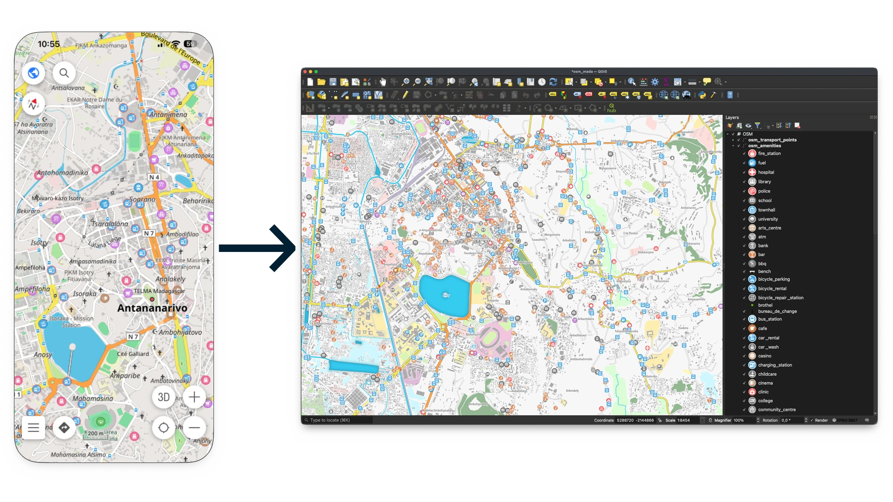
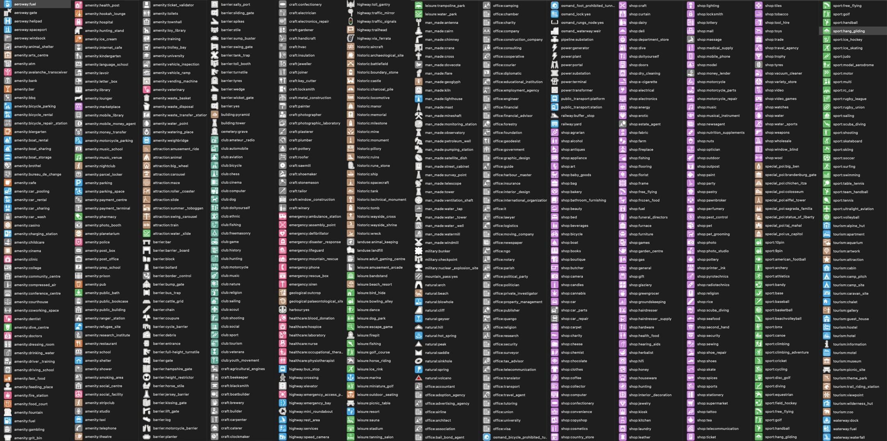
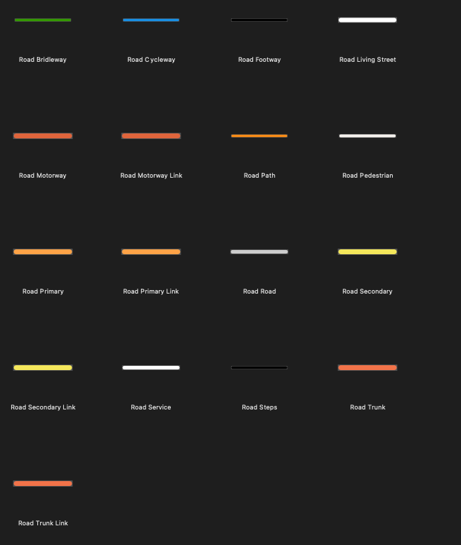

# OSMAnd to QGIS Styles

Easily convert [OSMAnd style resources](https://github.com/osmandapp/OsmAnd-resources) into QGIS XML styles.



> **LICENSE NOTE:**  
> This tool translates OSMAnd style definitions and icons into QGIS XML styles. Please ensure you comply with the licenses of the original OSMAnd resources. For details, see [OsmAnd-resources License](https://github.com/osmandapp/OsmAnd-resources?tab=License-1-ov-file) and [OsmAnd License](https://github.com/osmandapp/Osmand/blob/master/LICENSE).

> **Special Thanks:**  
> Grateful acknowledgment to the OSMAnd and OSMAnd resources contributors for providing these open source resources to the community.

## Requirements

- QGIS 3.x
- git
- Python 3.6+
- lxml

## Quick Start

```sh
git clone git@github.com:Xpirix/osmand2qgis-style.git
cd osmand2qgis-style
git clone git@github.com:osmandapp/OsmAnd-resources.git
pip install lxml
python osmand2qgis_point.py
python osmand2qgis_road.py
```

Each script outputs a `.xml` file in the **examples** directory.

## Loading XML Styles in QGIS

To import styles in QGIS 3.x:

- Go to **Settings -> Style Manager...**
- In the sidebar, select **Import/Export -> Import Item(s)...**
- Choose **File** as the source and select a style from the **examples** folder
- After loading, click **Select All** and then **Import**
- The symbols will appear under the **OSMAnd** tag

## Points Style



> NOTE: The screenshot displays map icons from OSMAnd resources loaded in QGIS. Icon licenses vary: some are Public Domain, some CC0, and some CC-BY-SA 2.0 by Markus59 (osm-icons.org).

## Roads Style



## TODO

- Polygon Styles
- Text Styles
- Additional styles
- Complete current styles
- Possibly add rendering rules and more...

---

Made with ❤️ by Lova Andriarimalala (@Xpirix).
